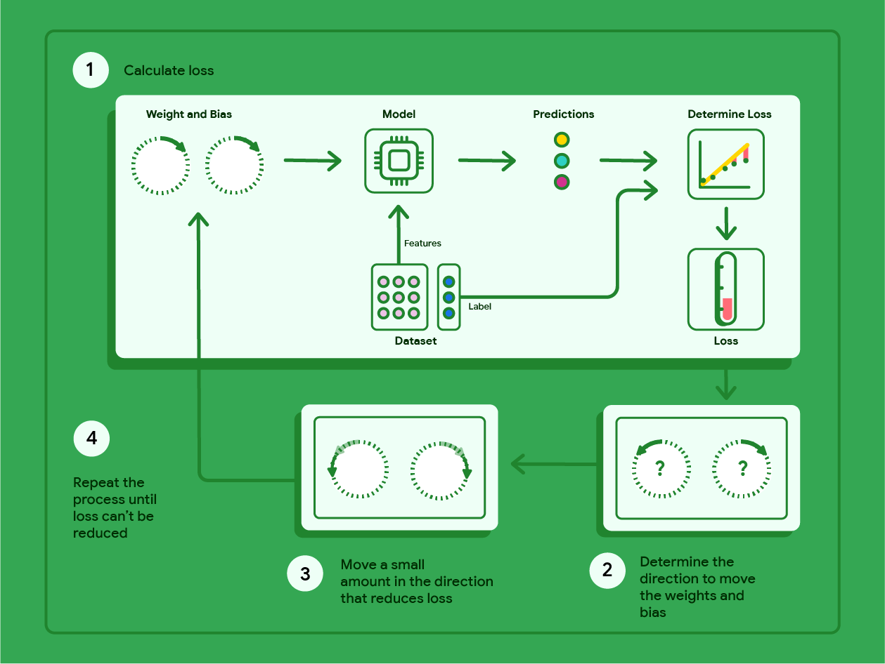

# **Recherche génération glossaire.** 

Comme expliqué dans l’index du Mkdoc, pour notre application, nous souhaitons utiliser une intelligence artificielle.
N’ayant aucune idée de la manière de procéder, nous avons effectué de nombreuses recherches (modèles à utiliser, création d’un modèle, modèles déjà existants, appel à des API, phase d’entraînement, etc.).
Tout l’article recense nos recherches ainsi que leur évolution, leur abandon ou la justification de ces dernières.

## **La création d'un modèle d'intelligence artificielle.**

En premier, nous nous sommes renseigner pour comprendre comment créer une intelligence artificielle. 
Nous avons receuilli les informations suivantes.

- Un hyperparamètre est une limite imposé par l'homme sur l'ia. Contrairement au paramètre classique, l'ia ne peut pas les modifier.
- Le taux d'apprentissage influence la convergenge d'un modèle, il doit être équilibré. Car trop fort, le modèle ne convergera pas et trop faible, le modèle sera trop lent. Le taux d'apprentissage peut être utilisé pour définir le nombre de génération d'un modèle, pour qu'il converge.

